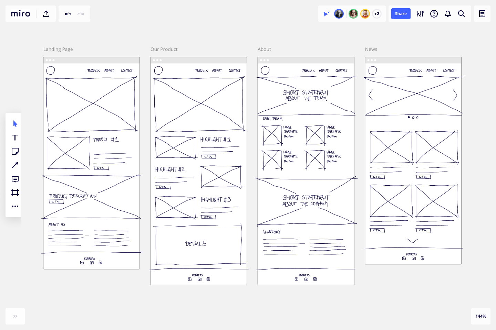
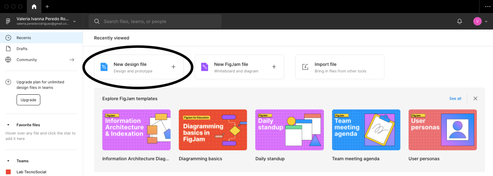

# Herramientas básicas para wireframing

### ¿Qué es un wireframe?

Un wireframe es un esquema que representa el esqueleto o la estructura visual de un sitio web o aplicación móvil. Usualmente estos esquemas carecen de estilo tipográfico, imágenes o colores, porque su principal objetivo es mostrar la funcionalidad del producto. Sobre la base de estos esquemas pueden construirse prototipos de productos digitales de más alta fidelidad.

# Introduciendo Figma

### ¿Qué es Figma?

Figma es una herramienta gratuita de ilustración vectorial y construcción de prototipos de aplicaciones web o móviles. Figma tiene herramientas que se enfocan en desarrollo de interfaces de usuario y el diseño de la experiencia de usuario, y permite trabajo en equipo a tiempo real.

### Iniciar sesión en Figma

Para ingresar desde el navegador, dirígete a la dirección de Figma: [https://www.figma.com/](https://www.figma.com/). Una vez allí, en la parte superior derecha dale click a *Sign Up* e ingresa tu correo electrónico y una contraseña para crear una nueva cuenta, o inicia sesión con tu cuenta de Google.

_10.30.08.png)

_10.31.00.png)

¡Y listo, ya estás dentro de la aplicación web!

_10.32.28.png)

### Crear un nuevo proyecto

En la página de inicio de la app, dale click a New Design File. Esta opción te abrirá una pestaña con tu nuevo archivo de diseño.

### La interfaz de Figma

Una vez abierto tu primer proyecto, observarás el espacio de trabajo de Figma, donde se realizan los diseños y los prototipos. La interfaz de la herramienta se compone, principalmente, de cuatro partes:

1. La barra de herramientas.- aquí se encuentran las herramientas básicas de diseño, la herramienta  seleccionar, la herramienta para crear *frames,* la herramienta para crear figuras geométricas, la herramienta de texto, entre otras.
2. El panel de las capas.- En este panel podrás observar las capas y los *frames* de tu diseño
3. El canvas.- En este espacio se diseñan los prototipos
4. El panel de diseño.- Aquí puedes configurar diferentes características del texto, figuras o imágenes de tu prototipo

_10.45.01.png)

# Creamos nuestro primer Wireframe

Aprenderemos a utilizar Figma con el desarrollo de un proyecto: una red social móvil para mascotas. Nuestro cliente solicita que la app cuente con 3 funciones:

- Una sección para compartir posts
- Un espacio de mensajería
- Una sección de perfil personal

### Crear frames

Nuestro proyecto está pensado para celulares android. Para crear un frame de android nos dirigimos a la barra de herramientas y seleccionamos la herramienta frame. 

_11.01.07.png)

Nos dirigimos al panel de diseño y damos click a *phone → Android Small.* Veremos que en el canvas, se habrá creado un frame de android.

_11.03.17.png)

_11.04.56.png)

### Crear figuras geométricas y cuadros de texto

Lo primero que crearemos es la estructura básica de un post. En la barra de herramientas, seleccionamos la herramienta de figuras geométricas, que está representada por un pequeño “⏹”. Seleccionamos el rectángulo, le damos click al frame de android creado y jalando construimos nuestra primera figura geométrica.

_11.08.26.png)

Le damos click al rectángulo para seleccionarlo y este estará rodeado por una línea color celeste. Nos dirigimos al panel de diseño, nos dirigimos a *stroke* y le damos click a “+”, esto hará que nuestra figura geométrica tenga un borde color negro:

_11.13.19.png)

Posteriormente, en el mismo panel de diseño, nos dirigimos a la pestaña *fill* y le damos click al “-”, para quitarle el color gris. La figura resultante debería ser la siguiente:

_11.15.10.png)

Ahora crearemos la foto de perfil de quien publica. Volvemos a la herramienta de figuras geométricas, esta vez seleccionamos el elipse. Damos click al frame, encima del rectángulo que creamos anteriormente, y jalamos el mouse mientras presionamos la tecla shift. Esto nos ayudará a crear un círculo perfecto.

_11.29.03.png)

Posteriormente repetimos el mismo proceso que con el rectángulo. Seleccionando nuestro círculo, nos dirigimos al panel de diseño, quitamos el color de relleno en *fill* y le añadimos una línea al rededor en *stroke*. El resultado debería ser el siguiente:

_11.33.25.png)

Finalmente añadiremos el nombre del que postea. Para ello, nos vamos a la barra de herramientas, y seleccionamos la herramienta de texto, que está representada por una pequeña “T”. Damos click al lado derecho de nuestro círculo y jalamos hacia la izquierda, esta acción nos generará un pequeño cuadro de texto, en el cual podemos escribir lo que queramos. Vamos a escribir “Nombre”.

_11.39.45.png)

Con la foto de perfil, el nombre, y la fotografía posteada, ya tenemos la estructura básica de un post para la aplicación que estamos diseñando. Si queremos podemos añadir más elementos utilizando figuras geométricas y texto, para construir una unidad de publicación un poco más compleja. En este ejemplo te presentamos un post que también incluye reacciones (representadas en pequeños cuadrados debajo de la fotografía) y la descripción del post.

_11.42.31.png)

### Creación de grupos

Terminaremos nuestro primer wireframe con la ayuda de una función más de Figma: los grupos. 

Una vez creados y acomodados todos los elementos que componen un post, los seleccionamos utilizando el mouse y presionamos las teclas CTRL + G para formar un grupo.

_11.50.43.png)

Una vez construido nuestro grupo, podemos copiarlo y pegarlo. Seleccionamos el grupo, presionamos CTRL + C y CTRL + V y veremos que todos los elementos del grupo que hemos creado se han duplicado. Podemos mover este elemento debajo de nuestro primer post y así tenemos nuestro primer wireframe de una red social.

_11.54.25.png)

Te invitamos a seguir combinando la creación de frames, figuras geométricas, texto y grupos para generar los wireframes para el servicio de mensajería y el espacio del perfil personal de este primer proyecto.

_11.57.01.png)