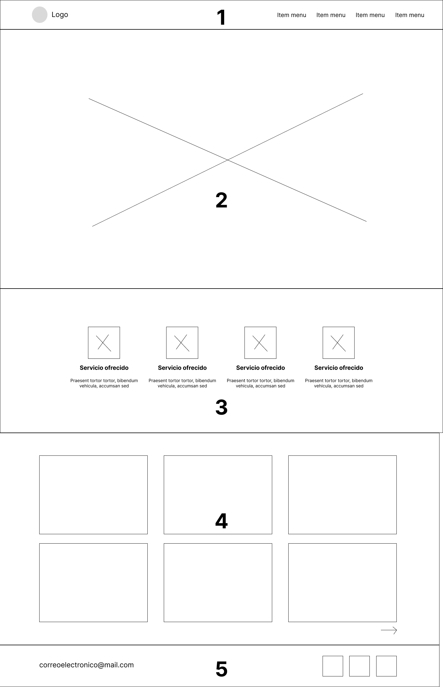

# Herramientas para la construcción de la página de inicio de un sitio web

### Estructura típica del inicio de una página web

Una página web típica está compuesta de cinco secciones:

1. Header: Es la cabecera de un sitio web y se encuentra en su parte superior. En esta sección se incluyen las opciones de navegación del sitio web y su logo.
2. Portada: Es la sección que aparece debajo del header o menú de navegación. Generalmente incluye imágenes o videos que ofrecen información sobre la identidad del sitio web que estamos construyendo.
3. Servicios ofrecidos: es una sección en la que sintetizamos, generalmente con el apoyo de íconos y algunas palabras clave, los principales servicios, especialidades o temas que se tratan en el sitio web.
4. Sección de posts: es el espacio del inicio de un sitio web donde se muestran las publicaciones más recientes. Generalmente tiene una estructura de cuadrícula, y los posts están representados en tarjetas que contienen imágenes y texto.
5. Footer: es la parte inferior de un sitio web, que se encuentra debajo de todos los componentes anteriormente mencionados. Generalmente contiene información de contacto o enlaces a redes sociales.

Puedes observar esta estructura en el siguiente wireframe.

### Herramientas para construir paletas de colores

**Coolors**

Esta herramienta gratuita nos permite generar paletas de colores a partir de un generador. Las paletas de colores se van generando al azar y podemos escogerlas y descargarlas para nuestros proyectos. Visitar: [https://coolors.co/generate](https://coolors.co/generate)

_12.25.19.png)

**Color Palette Generator (Canva)**

Esta herramienta desarrollada por canva nos permite obtener paletas de colores a partir de fotos que podemos importar. Visitar: [https://www.canva.com/colors/color-palette-generator/](https://www.canva.com/colors/color-palette-generator/)

_12.22.47.png)

### Herramientas para obtener íconos

**Flaticon**

Flaticon es un sitio web que ofrece cientos de íconos gratis para utilizar en nuestros proyectos. Visitar: [https://www.flaticon.es/](https://www.flaticon.es/)

_12.26.34.png)

### Herramientas para generar tipografías

Existen herramientas que nos permiten descargar diversas tipografías y nos ayudan a elegir fuentes que combinan entre sí.

**Google Fonts**

Visitar: [https://fonts.google.com/](https://fonts.google.com/)

_12.27.58.png)

**Font Pair**

Visitar: [https://www.fontpair.co/](https://www.fontpair.co/)

_12.29.32.png)

### Fuentes de inspiración para diseñar

Para construir nuestros sitios web, es bastante útil observar las ideas de otros diseñadores. Existen sitios web donde podemos encontrar bastantes proyectos inspiradores.

**Dribbble**

Visitar: [https://dribbble.com/](https://dribbble.com/)

_12.32.06.png)

**Pinterest**

Visitar: [https://www.pinterest.es/](https://www.pinterest.es/)

_12.33.03.png)